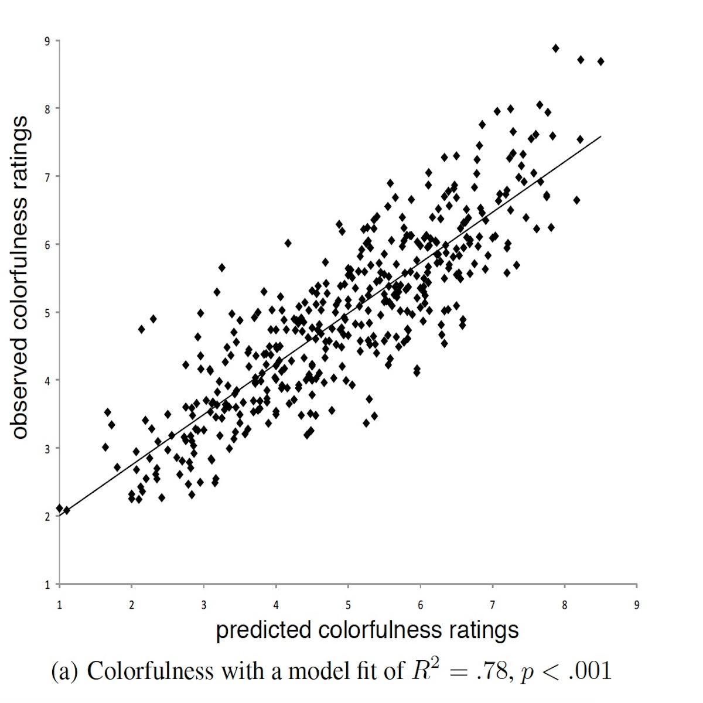

<!-- Replication reports should all use this template to standardize reporting across projects.  These reports will be public supplementary materials that accompany the summary report(s) of the aggregate results. -->

##Introduction
In the [paper](https://github.com/psych251/reinecke2013/blob/master/original_paper/reinecke2013.pdf) "Predicting Users' First Impressions of Website Aesthetics With a Quantification of Perceived Visual Complexity and Colorfulness" Reinecke et al. propose a computational model for predicting users' initial reactions to a website's appearance. This paper builds upon the existing literature that indicates that colorfulness and visual complexity are two primary design features that contribute to website aesthetics. The authors propose models for predicting users' ratings of colorfulness and visual complexity based on computed low-level image features. The focus of this replication is the colorfulness model.

In this replication of the colorfulness model generated by Reinecke et al. (2013), we aim to reproduce the methodology used in the original paper. First, we use the authors' provided website screenshots and their computed low-level image features. These features include the basic HTML colors as well as measures of colorfulness and information density. Next, we conduct an experiment on MTurk, asking users to rate the colorfulness of these images. From the data we develop a computational model relating the low-level image statistics to users' ratings of colorfulness, as the original authors do.

Here are links to the [Github repository](https://github.com/psych251/reinecke2013) and the [preregistration](https://osf.io/3xps4/) for this project.

##Methods

###Power Analysis
For this particular analysis, power analysis is not appropriate. We use 100 participants and have each rate 30 images so that we have enough ratings for most of the 450 randomly selected website images.

###Planned Sample
We use a similar sample to the participant sample selected in the original paper, described as:

> "Our final data consist of 184 participants (96 female) aged between 15 and 58 years (mean = 21.1) for the colorfulness experiment." 

In our study we start with 100 participants. We also follow the exclusion criteria specified in the original paper:

> "Participants were excluded from the analysis if they had previously participated in the same study and/or did not have normal or corrected-to-normal vision."

###Materials
We use the same materials as the original authors. This includes the 450 website images provided by the authors as well as the computed visual features, both of which are available [here](http://www.labinthewild.org/data/index.php).

###Procedure	
We follow a similar procedure to the one described in the original article as:

> "The experiments were implemented as 10-minute online tests on our own experimental platform LabintheWild.org and advertised in online communities and university newsletters. Both experiments followed the same pattern: Participants were asked to rate screenshots of websites that were shown for 500ms each (following the experiment procedure in [23]). The small exposure time avoids an in-depth engagement with the content of the sites, and instead captures participants’ initial reactions towards colorfulness and visual complexity. In the first evaluation phase, we presented each participant with a stratified random sample of 30 websites selected from the larger pool of 450 websites. The 22 English, 4 foreign (using a different script), and 4 grayscale websites were presented in random order. Participants rated every website on a 9-point Likert scale from “not at all complex” to “very complex” or “not at all colorful” to “very colorful”, depending on the experiment. After being encouraged to take a short break, we gave a second evaluation phase where participants re-rated the same 30 websites in a different random order so that we could measure consistency in their judgement. Before the two evaluation phases, we gave a short practice phase during which all participants were asked to evaluate a fixed set of five websites, given in randomized order. We also collected demographic information about each participant, such as gender, age, education level, and current country of residence, in order to control for these factors in the analysis."

###Analysis Plan
The goal of this analysis is to replicate the first set of experiments in Reinecke et. al, 2013. For all analyses we follow the first of the data exclusion criteria the original authors describe: 

> "We additionally excluded websites that had received three or fewer ratings (due to the random assignment to participants), or where the standard error of their mean complexity was ≥ 0.75." 

We do not follow the second guideline for data exclusion because this replication does not collect data on mean complexity.

The primary analysis to perform is computing the prediction model for perceived colorfulness. For this analysis we use multiple linear regression with backward elimination. The model begins with the authors' original set of image statistics, and then different variables are removed according to the process described in the original paper: 

>"In this method, all predictors are initially added to the model, and iteratively removed if they do not make a statistically significant contribution to how well the model predicts the outcome variable (the ratings, in our case). At each step, the remaining predictors are reassessed in terms of their contribution to the newly calculated model." 


###Differences from Original Study
We run all experiments in the replication on MTurk as opposed to Lab in the Wild, which has an unpaid citizen science reward model. Characterizing participants on Lab in the Wild is an area of ongoing research. So far researchers have found that participants come from almost every country in the world and users are motivated to participate because they get to see how their results compare to others (Reinecke & Gajos, 2015). We do not anticipate that the difference in experiment platform will influence the results in this study. The original study participants were as young as 15, but in this replication the minimum age is set at 18, as required by MTurk. One step in the authors' original experiments is determining if users' demographic backgrounds influence their judgments of website colorfulness and visual complexity. The original finding is that these demographic variables do not influence these specific aesthetic judgments.

```{r Load libraries and data}
####Load Relevant Libraries and Functions
library(tidyverse)
library(readr)
require(ggplot2)
library(dplyr)
library(reshape2)

###Data Preparation
data_path = "../replication_data/finalDataCollection_out.csv" 

####Import data
d <- read_csv(data_path)
d_dim <- dim(d)
#print(c("d dims: ", d_dim))
#head(d)
```
```{r Filter data}
#### Data exclusion / filtering
# get the number of participants
num_workers_start <- length(unique(d$workerNum)) #before filtering
num_retake <- length(unique(d$workerNum[which(d$retake == 'Yes')])) #number who checked retake
num_vision_no <- length(unique(d$workerNum[which(d$vision == 'No')])) #number who failed vision check

print(c("started with ", num_workers_start, " participants"), quote = F)
print(c(num_retake, " indicated retake"), quote = F)
print(c(num_vision_no, " participants did not pass the vision test"), quote = F)

#get rid of workers who have taken the test before or don't meet the vision requirement; also remove all grayscale and practice images
filtered_data <- d %>%
  filter(retake == 'No', vision == 'Yes', image_type != "grayscale", image_type != "practice")

#get the number of workers after filtering
num_workers_end <- length(unique(filtered_data$workerNum))
print(c("ended with ", num_workers_end, " participants"), quote = F)

# filter CSV for websites with too few ratings
website_count_filtered_data <- filtered_data %>%
  group_by(websiteName) %>%
  filter(n() >= 4) #exclude websites without at least 4 ratings
```

```{r Demographic data}
#demographic data
age_data <- filtered_data %>%
  group_by(workerNum) %>%
  summarize(agePerWorker = age[1]) %>%
  summarize(meanAge = mean(agePerWorker, na.rm = T), minAge = min(agePerWorker, na.rm = T), maxAge = max(agePerWorker, na.rm = T))
  
#look at gender of participants
print(c("mean age: ", age_data$meanAge), quote = F)
print(c("min age: ", age_data$minAge), quote = F)
print(c("max age: ", age_data$maxAge), quote = F)

gender_data <- filtered_data %>%
  group_by(workerNum) %>%
  distinct(workerNum, .keep_all = T) %>%
  mutate(isWoman = ifelse(gender == "Female", TRUE, FALSE), isMan = ifelse(gender == "Male", TRUE, FALSE), isOther = ifelse(!(gender == "Female" | gender == "Male"), TRUE, FALSE))

numWomen = sum(gender_data$isWoman)
numMen = sum(gender_data$isMan)
numOther = sum(gender_data$isOther)

print(c("number of women: ", numWomen), quote = F)
print(c("number of men: ", numMen), quote = F)
print(c("number of other: ", numOther), quote = F)
```

### Methods Addendum (Post Data Collection)

#### Actual Sample
We started with 100 workers recruited on MTurk. `r num_vision_no` participants did not meet the vision criteria of normal or corrected-to-normal vision and color vision. `r num_retake` participants indicated they were retaking the test so their responses were excluded. Our final participant sample had `r num_workers_end` participants (`r numWomen` women and `r numMen` men). The mean age of participants was `r round(age_data$meanAge, 2)`, and workers ranged in age from `r age_data$minAge` to `r age_data$maxAge`.

The original study authors provided 450 images. They excluded 15 images based on additional exclusion criteria for their subsequent models, so for our replication we started with these 435 website images from the original authors. In our analysis we excluded the practice and grayscale images as well as any images without at least 4 ratings. After this filtering stage, we were left with 282 website images to use in our analysis.


#### Differences from pre-data collection methods plan
None.


##Results


### Data preparation
We collect data for both the computational image statistics as well as users' ratings of website image colorfulness. First, we begin with the authors' computed image statistics. Each of these different image measurements is treated as a single variable in our regression. For each user we collect their age, country of residence, native language, highest level of education, and if they have normal or corrected-to-normal vision. We exclude all data from participants without normal or corrected-to-normal vision.

For all of the analyses, the data are organized with each row as a different observation for user data (i.e., each participant, website, and trial matching). We merge the user data with the computational image metrics by adding columns to the data for each of the computational image metrics (16 HTML colors and 21 additional derived metrics), and then we group the data by website image. We then identify websites with three or fewer ratings and filter out this data.

For the primary analysis: developing a model to compare the image metrics to users' ratings of colorfulness, we prepare our data for running multiple linear regression with backward elimination. To do this we start with all of our low-level image features as the independent variables and the participants' mean colorfulness scores as the dependent variable. We iteratively remove image feature variables if they do not make statistically significant contributions to the model and update the model.


```{r Prepare data for analysis}
#### Prepare data for analysis - create columns etc.
#add a column for mean score
mean_score_data <- website_count_filtered_data %>%
  mutate(meanScore = (score + score2)/2.0) %>% #add a column with the mean for each trial
  group_by(websiteName) %>% #group data by website name
  mutate(meanScore = mean(meanScore))

#all column names for model
myvars = c("websiteName", "meanScore", "black","silver","gray","white","maroon","red","purple","fuchsia","green","lime","olive","yellow","navy","blue","teal","aqua","hue","saturation","value","textArea","nonTextArea","numOfLeaves","percentageOfLeafArea","numOfTextGroup","numOfImageArea","colorfulness1","colorfulness2","colorHorizontalSymmetry","colorVerticalSymmetry","intensityHorizontalSymmetry","intensityVerticalSymmetry","intensityHorizontalBalance","intensityVerticalBalance","numOfQuadTreeLeaves_color","numOfQuadTreeLeaves_intensity","colorEquilibrium","intensityEquilibrium")
data_for_lm = mean_score_data[myvars]

#reduce data to one row per website
data_for_lm_by_website <- data_for_lm %>%
  distinct(websiteName, .keep_all = TRUE)

#remove all na values as a preprocessing step
data_for_lm_by_website<-na.omit(data_for_lm_by_website)

#data_for_lm_by_website
#dim(data_for_lm_by_website)

num_before_websites <- length(unique(d$websiteName)) #number of websites at start
num_remove_grayscale_practice <- length(unique(data_for_lm_by_website$websiteName)) #number of websites filtered for grayscale or practice
num_final_websites <- length(unique(data_for_lm_by_website$websiteName)) #number of websites after filtering for count
print(c("started with ", num_before_websites, " website images"), quote = F)
print(c("got ", num_final_websites, " website images after count filter"), quote = F)
```

### Confirmatory analysis
The main contribution of the original paper's experiments that are the focus of this replication report is the model predicting users' ratings of a website's colorfulness from low-level image features of the website. We replicate this original model using our collected user colorfulness scores and the provided image statistics. We use multiple linear regression with backward elimination to eliminate not statistically significant image features and build our final model. 

```{r Linear model}
#### Create model
#get initial fit
fit <- lm(meanScore ~ black+silver+gray+white+maroon+red+purple+fuchsia+green+lime+olive+yellow+navy+blue+teal+aqua+hue+saturation+value+textArea+nonTextArea+numOfLeaves+percentageOfLeafArea+numOfTextGroup+numOfImageArea+colorfulness1+colorfulness2+colorHorizontalSymmetry+colorVerticalSymmetry+intensityHorizontalSymmetry+intensityVerticalSymmetry+intensityHorizontalBalance+intensityVerticalBalance+numOfQuadTreeLeaves_color+numOfQuadTreeLeaves_intensity+colorEquilibrium+intensityEquilibrium, data=data_for_lm_by_website, na.action=na.exclude)

#do backward elimination
stepped_model <- step(fit, direction = "backward", trace=FALSE ) 

#show model summary
summary(stepped_model)
```

```{r Plot model}
#### plot data
#pdf('model.pdf',width=6,height=6,paper='special')
replication_plot <- ggplot(stepped_model$model, aes_string(x = fitted(stepped_model), y = data_for_lm_by_website$meanScore)) +
  geom_point(na.rm=TRUE) +
  stat_smooth(method = "lm", col = "red", na.rm=TRUE) +
  scale_x_continuous(limits=c(1, 9.5), breaks=seq(1,9,1))+
  scale_y_continuous(limits=c(1, 9.5), breaks=seq(1,9,1))+
 labs(title = paste("Adj R2 = ",signif(summary(stepped_model)$adj.r.squared, 5),
                     "Intercept =",signif(stepped_model$coef[[1]],5 ),
                     " Slope =",signif(stepped_model$coef[[2]], 5),
                     " P =",signif(summary(stepped_model)$coef[2,4], 5)), x = "predicted colorfulness ratings", y = "observed colorfulness ratings") + theme_classic() + theme(panel.grid.major = element_blank(), panel.grid.minor = element_blank())

```

Here is a graphical comparison of the original model and the replication model:
<h3> a) Original model: </h3>
<div id = "imageholder" style = "width: 100%; display: inline;">
<figure style = "display: inline;">

</figure>
</div>

<h3> b) Replication model: </h3>

```{r show replication plot}
replication_plot
```


We also provide an [interactive visualization](https://web.stanford.edu/~mleake/psych251/mturk_experiment/viz/) for inspecting the replication model and corresponding website screenshots.

###Exploratory analyses
After building our model, our goal is to compare the model from this replication to the model the original authors provide. To do this we compare the sets of statistically significant image features in the two models and compute the Jaccard index. 


```{r Model comparison}
#comparison with original model
significant_summary <- data.frame(summary(stepped_model)$coef[summary(stepped_model)$coef[,4] <= .05, 4])
sig_factors <- c(row.names(significant_summary)[2:dim(significant_summary)[1]])
original_sig_factors <- c("gray", "white", "maroon", "green", "lime", "blue", "teal", "saturation", "colorfulness2", "numOfImageArea", "numOfLeaves", "textArea", "nonTextArea")

in_both_models <- c(intersect(original_sig_factors, sig_factors))
only_in_original <- setdiff(original_sig_factors, in_both_models)
only_in_replication <- setdiff(sig_factors, in_both_models)
sig_models_union <- union(original_sig_factors, sig_factors)
jaccard_index <- length(in_both_models)/length(sig_models_union) #union divided by intersection

print(c("the image stats in both models are: ", in_both_models), quote = F)
print(c("the image stats in the original but not the replication are: ", only_in_original), quote = F)
print(c("the image stats in the replication but not the original are: ", only_in_replication), quote = F)
print(c("the jaccard index is: ", jaccard_index), quote = F)
```


Using this method, we find a Jaccard index of `r round(jaccard_index, 3)` indicating roughly `r round(jaccard_index, 3)*100` percent similarity between the features in the two models. Both models indicate white, green, lime, colorfulness, number of image areas, number of leaves, text area, and non-text area are significant features. The following image features were in the original model, but were not found to be significant in the replication: gray, maroon, blue, teal, and saturation. Percentage of leaf area, number of text groups, intensity for horizontal balance, number of quadtree leaves for color, color equilibrium, and intensity equilibrium are features that appear in the replication model but not in the original.

To follow up on our comparison of the two models, we examined the correlations between different image features. Although the authors did not report feature correlations, we also examine the feature correlations to help build intuition about about why different image features are included in the final model. Through this analysis we find some expected correlations between features, such as between text and non-text areas, but the reasoning behind others is less clear.

```{r Heat map for feature correlation}
#show model summary with feature correlations
summary(stepped_model, correlation = TRUE)

#get the feature correlations for the replication model
corr_data <- summary(stepped_model, correlation = TRUE)$correlation
 
# code from: http://www.sthda.com/english/wiki/print.php?id=191#reorder-the-correlation-matrix
reorder_cormat <- function(cormat){
# Use correlation between variables as distance
dd <- as.dist((1-cormat)/2)
hc <- hclust(dd)
cormat <-cormat[hc$order, hc$order]
}

#reorder data for plotting heatmap
melted_cormat <- melt(reorder_cormat(corr_data))

heatmap_plot <- ggplot(data = melted_cormat, aes(x=Var1, y=Var2, fill=value)) + 
  geom_tile(color = "white") +
  scale_fill_gradient2(low = "blue", high = "red", mid = "white", 
   midpoint = 0, limit = c(-1,1), space = "Lab", 
    name="Correlation") +
  theme_minimal()+ # minimal theme
 theme(axis.text.x = element_text(angle = 45, vjust = 1.1, 
    size = 6, hjust = 1), axis.text.y = element_text(vjust = 0, 
    size = 6, hjust = 1)) +
  coord_fixed() +
  labs(title = "Correlations between features", x = "Image features", y = "Image features")
```

```{r Show heat map}
heatmap_plot
```

```{r Compare r2 of models}
fit <- lm(meanScore ~ black+silver+gray+white+maroon+red+purple+fuchsia+green+lime+olive+yellow+navy+blue+teal+aqua+hue+saturation+value+textArea+nonTextArea+numOfLeaves+percentageOfLeafArea+numOfTextGroup+numOfImageArea+colorfulness1+colorfulness2+colorHorizontalSymmetry+colorVerticalSymmetry+intensityHorizontalSymmetry+intensityVerticalSymmetry+intensityHorizontalBalance+intensityVerticalBalance+numOfQuadTreeLeaves_color+numOfQuadTreeLeaves_intensity+colorEquilibrium+intensityEquilibrium, data=data_for_lm_by_website, na.action=na.exclude)

my_fit <- data.frame(my_params = c(coef(fit)))

#follow up analysis to look at the original model with our data
their_params = c(-.68, 0, 0, 2.45, 2.74, 1.60, 0, 0, 0, 1.85, -3.17, 0, 0, 0, -3.91, 1.01, 0, 0, 0.01, 0, -0.00000148, 0.00000186, 0.000374, 0, 0, 0.06, 0, 0.03, 0, 0, 0, 0, 0, 0, 0, 0, 0, 0)

#fit is from my linear model above before stepwise elimination
fit$coefficients[1:length(fit$coefficients)] <- their_params
new_predictions <- predict(fit, data_for_lm_by_website)

fit$coefficients

# r-squared functions from: https://stackoverflow.com/questions/45793683/r-determine-goodness-of-fit-of-new-data-with-predict-function-based-on-existin
r_squared <- function(vals, preds) {
  1 - (sum((vals - preds)^2) / sum((vals - mean(preds, na.rm = T))^2))
}

r_squared_a <- function(vals, preds, k) {
  1 - ((1-r_squared(vals, preds))*(length(preds)-1))/(length(preds) - k - 1)
}

#get r2 for their model with my data
new_r2 <- r_squared(na.omit(data_for_lm_by_website$meanScore), na.omit(new_predictions))

#get adjusted r2 for their model with my data
new_r2_a <- r_squared_a(na.omit(data_for_lm_by_website$meanScore), na.omit(new_predictions), 13)

print(c("the r^2 is: ", new_r2), quote = F)
print(c("the adjusted r^2 is: ", new_r2_a), quote = F)
```

We also did some follow up analysis to explore how well the original model explains our collected data. On our replication data the original model had an adjusted r-squared value of `r round(new_r2_a, 2)`, as opposed to 0.78 on their original dataset. On our data their model's adjusted r-squared is lower than our model's adjusted r-squared (`r round(new_r2_a, 2)` vs. `r round(summary(stepped_model)$adj.r.squared, 2)`).

## Discussion

### Summary of Replication Attempt
In this replication, the goal was building a model of colorfulness similar to the original result and then comparing the two models. Only `r length(in_both_models)` out of `r length(original_sig_factors)` of the significant factors in the original model appeared in the replication model. The Jaccard index corresponding to the comparison between the two models indicates only a moderate amount of overlap between the two models.


### Commentary
While we did not expect to replicate the original model exactly, we have gained some intuition about why these types of models in HCI can be difficult to replicate. First, the original model had a large number of parameters, which can make the possibility of overfitting more likely. In our replication we only had sufficient ratings for `r num_final_websites` website images, instead of 435 like the original authors had. There can be some variability in which image statistics are relevant based on the set of input images, and the stepwise elimination process in the regression model can be unstable. Perhaps the strongest indication of the effects of overfitting and instability in the features chosen is the similarity in the r-squared values of the two models but the dissimilarity in the specific features in the two models.  We found it challenging to look at either the original or the replication model and reason about why certain image features instead of others were included in the final model. This further leads us to consider the implications of building these kinds of complex models with many different features.


```{r Data prep for interactive visualization, include = F}
library(jsonlite)
head(data_for_lm_by_website)

combined_data <- data.frame(data_for_lm_by_website$websiteName, data_for_lm_by_website$meanScore, fitted(stepped_model), fit$residuals)
colnames(combined_data) <- c("websiteName", "userScore", "imageScore", "fittedValues")
head(combined_data)

x <- toJSON(combined_data)

write(x, "websitedata.json")
```

